 

 

<table>
<tr>
<td width="230" valign="top" align="center">

</td>
<td valign="top">

### Hi, I'm Arghya

I'm a Computer Engineering student who likes building things people open twice: offline-first Android apps, cloud-backed platforms, and interfaces that hold up under real use.

- **Studying:** B.E. Computer Engineering at Thapar Institute, 3rd year (2023 to 2027)
- **Based in:** Patiala, Punjab. Originally from Kalyani, West Bengal
- **Focus:** Android, cloud, backend, and UI/UX
- **Works in:** VS Code and Android Studio, on Windows 11 and Linux

</td>
</tr>
</table>

 

## What I build

| Android | Cloud and backend | Interfaces |
|---|---|---|
| Offline-first apps in Kotlin and Jetpack Compose, with on-device OCR and encrypted storage where the data is personal. | FastAPI and PostgreSQL backends. Working across AWS and GCP, with infrastructure as code. | Designed in Figma before any code is written, then built with Material 3. |

 

## Featured projects

| Project | What it does | Stack |
|---|---|---|
| **HealthSaathi** *in progress, capstone* | Healthcare management platform with role-based access, real-time queue management, and SHA-256 audit hash chains for record integrity. | `FastAPI` `Flutter` `AWS` |
| **[PDF Wallet](https://github.com/NerdyNode/pwallet)** *in progress* | Offline-first Android wallet that auto-detects and organizes travel and ID documents. On-device OCR, encrypted storage, no backend. | `Kotlin` `Compose` `ML Kit` |
| **[SplitMint](https://github.com/NerdyNode/splitmint)** | Expense splitting for friends and groups, with a UPI-based settlement flow that makes repayments painless. | `JavaScript` |
| **[MediFlow](https://github.com/NerdyNode/mediflow)** | AI-powered medical form digitization with OCR, validation, and healthcare data integration. | `TypeScript` `AI` `OCR` |
| **[Dynamic Parking](https://github.com/NerdyNode/Dynamic-Parking-Pricing-System)** | Data-driven dynamic pricing for smarter parking systems and better space utilization. | `Python` |
| **[LazyCoffee](https://github.com/NerdyNode/lazycoffee)** | A self-hosted homelab for cloud storage, automation, and private services. | `Shell` |

<b>More projects</b>

 

| Project | What it is | Stack |
|---|---|---|
| [Age-Prediction-ML](https://github.com/NerdyNode/Age-Prediction) | Classification model that predicts age categories. | `Python` `XGBoost` |
| SpendMint | Six-screen Material 3 finance app, designed as a full system in Figma. | `Figma` `Material 3` |
| Expense Tracker | Offline Android tracker that parses GPay PDF statements and auto-categorizes transactions with fuzzy matching. | `Kotlin` `Compose` `Room` |

 

## Toolbox

| Area | Tools |
|---|---|
| **Languages** |  |
| **Mobile and web** |    |
| **Backend and data** |  |
| **Cloud and infra** |   |
| **Design and tools** |  |

 

## Currently

- Building **HealthSaathi**, a healthcare platform, as my capstone
- Finishing **PDF Wallet**, an offline-first document wallet for Android
- Growing **LazyCoffee**, my self-hosted homelab
- Going deeper on DSA, system design, and AI
- Experimenting with Arduino

 

## Activity

  

 

**Learn. Build. Share. Repeat.**

Fuelled by coffee and curiosity.

